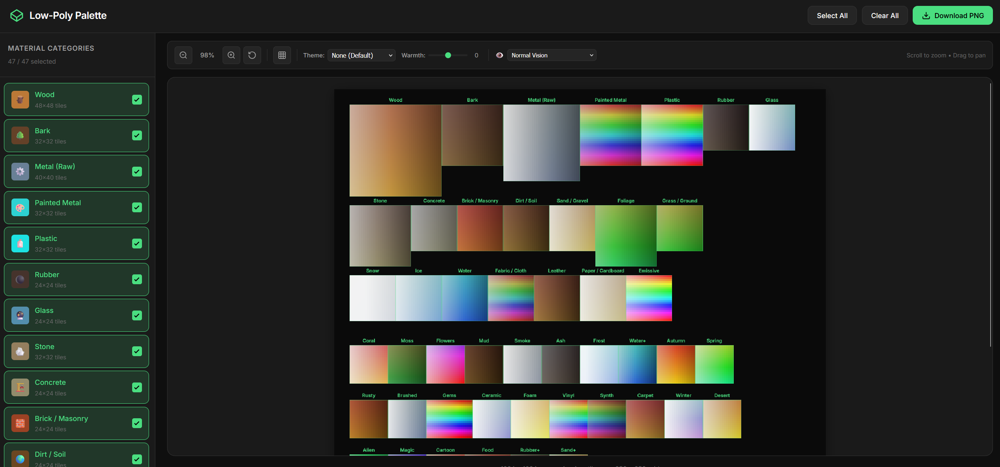

# Low-Poly Palette Generator

https://commanderfoo.github.io/palette-generator/

A web-based tool for generating flat color palettes optimized for **Blender** and **low-poly game development**. Create semantically organized material atlases that can be used as a single texture for coloring multiple models.

## What It Does

Generates a **1024×1024 PNG palette atlas** with organized color regions for common material types:
- **Natural Materials**: Wood, stone, dirt, sand, foliage, grass, water, ice, snow
- **Industrial**: Metals (raw, rusty, brushed), concrete, brick, plastic, rubber
- **Stylized**: Emissive glow, magic effects, cartoon/toy colors
- **Environmental**: Smoke, ash, frost, seasonal themes
- **And more** — 43 material categories total

Each region contains a gradient of related colors (light→dark, warm→cool) for quick UV mapping in Blender.

## Why Use This?

**For Low-Poly Workflows:**
- Map multiple objects to one shared palette texture
- Reduce material count and draw calls in games
- Maintain consistent color language across your project
- Easily swap themes (sunset, icy, rustic, neon, etc.)

**Key Features:**
- 🎨 **Thematic Palettes** — 8 built-in themes that shift the entire palette's mood
- 🌡️ **Warmth Slider** — Fine-tune overall color temperature
- 👁️ **Colorblind Simulation** — Check accessibility (Protanopia, Deuteranopia, Tritanopia)
- 🔍 **Zoom & Pan** — Inspect colors up close
- 📥 **PNG Export** — Download and use directly in Blender/Unity/Godot

## Quick Start

1. Open `index.html` in a browser
2. Toggle material categories on/off as needed
3. Optionally select a theme and adjust warmth
4. Click **Download PNG**
5. Import into Blender as your palette texture

## Usage in Blender

1. Import the generated PNG as an image texture
2. Set up a material with the palette as the Base Color
3. UV unwrap your low-poly models
4. Position UVs over the desired color regions
5. All models sharing the palette material will render with consistent colors

## Tech Stack

- Vanilla HTML/CSS/JavaScript (no dependencies)
- HTML Canvas for rendering
- LocalStorage for persisting category selections

## Credits

This project was coded by **Claude** (Anthropic's AI assistant) through pair programming.

## Vibe Coder Alert

Look mom, I am a Vibe Coder!

Wrote this in about 30 mins with Claude's help. Barely touched the code. It did get confused a few times with panning and adding text above the categories on the canvas, but with a bit of guidance, it was able to finish the job.

## License

MIT License — see [LICENSE](LICENSE) for details. Use freely for personal and commercial projects.
